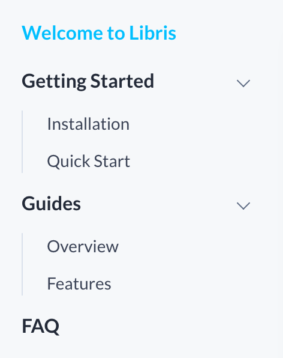

# Libris Hugo

A port of the [Stackbit Libris](https://github.com/stackbithq/stackbit-theme-libris) theme for use with Hugo.  [Live Demo](https://pjeby.github.io/libris-hugo/)

[](https://pjeby.github.io/libris-hugo/)

Note: I am still refactoring things to be more Hugo-friendly, so things may change a lot.  If you update your local copy of this theme to a new version, *you should expect things to break*.  The theme is currently quite functional (even more so than the original in some aspects), but I expect to still be refactoring various things in the future, like:

* configurable language support for prism highlighting
* improved page components system and DRY rendering thereof
* list pagination
* proper kind/section/layout hierarchy mapping (a lot of stuff is still organized by layout only)
* better separation between the theme and the example site (some site stuff may still be in the theme)

And any or all of these changes might be backward-incompatible with the effective "API" of a previous release.

## Creating Documentation Areas

A site can have one or more documentation areas, each with their own customized navigation pane.  To create such an area, add the following front matter field to the `_index.md` of a `contents` subdirectory you want to make into such an area (e.g. `contents/docs/`):

```yaml
---
cascade:
  # Default to the 'docs' layout for everything under this directory
  layout: docs

  # Path to the first page or section to be displayed on the nav pane; if omitted,
  # it defaults to this area's top-level section (e.g. /docs, /posts, etc.)
  nav_top: /docs

  # Paths to the pages or sections to be displayed as contents in the nav pane
  # Paths are interpreted relative to nav_top; you can use absolute paths to bring
  # in sections or pages from elsewhere in the site.
  nav_pane:
    - getting-started
    - guides
    - faq
---
```

Once this is done, any pages or subsections created under the directory where this file is located will automatically use the `docs` layout and have a navigation pane with the listed entries.  Each `nav_pane` item can be a page or section; if it's a section, its immediate child pages will be listed in the nav pane as a collasped submenu, ordered by weight.  You can also add something like this to pages whose submenus you want to customize:

```yaml
---
# Adding nav_items to a page or section listed in a nav_pane lets you set what pages
# will be listed as child items in the nav bar; if you don't set it, all child pages
# are listed, ordered by weight.  Relative paths are looked up relative to this page
nav_items:
  - first-page
  - second-page
---
```

This is usually a lot easier than fiddling with weights across multiple files, especially in a large project: just go to the "parent" page and add a `nav_items` list.  (You can also do this to add literally any pages you like to the menu.)

Documentation areas can also include pages with the `overview` layout: these don't have a navbar, but instead display all the top-level items from the navbar in an article-preview format with their `summary` or excerpt autogenerated by Hugo.  All pages or sections referenced by `nav_pane` and `nav_items` must also have a `title` in order to be displayed properly on the navbar or on overview pages.

(Notice, by the way, that you do not need to have a documentation area in order to use the overview layout: it just requires a `nav_pane` property set on the page or cascaded from a parent.  Likewise, pages or sections listed in `nav_pane` or `nav_items` do not have to use `docs` layout, and can be any page or section of the site.)

### Example

Here is an example folder structure for a single documentation area, `/welcome`:

```
.
├── content
│   ├── welcome
│   │   ├── _index.md            [documentation root page, "Welcome To Libris"]
│   │   ├── getting-started
│   │   │   ├── _index.md        [section parent page]
│   │   │   ├── installation.md  [section child page]
│   │   │   └── quick-start.md   [section child page]
│   │   ├── guides
│   │   │   ├── _index.md        [section parent page]
│   │   │   ├── features.md      [section child page]
│   │   │   └── overview.md      [section child page]
│   │   └── faq
│   │   │   └── _index.md        [section parent page]
│   │   └── ...
│   └── ...
└── ...
```

`content/welcome/_index.md`:

```yaml
---
title "Welcome To Libris"

cascade:
  layout: docs
  nav_top: /welcome
  nav_pane:
    - getting-started
    - guides
    - faq
---
```

`content/docs/guides/_index.md`:

```yaml
---
title: Guides
nav_items: [ overview, features ]   # explicit order for sub-pages
---
```





### Callouts

To add a callout to your documentation, simply use the following html markup:

```html
<div class="important">
  <strong>Important:</strong> 
  This is the "Important" callout block of text. It indicates a warning or caution.
  Use it for an important message. 
</div>
```

```html
<div class="note">
  <strong>Note:</strong> 
  This is the "Note" callout block of text. It signifies a general note.
</div>
```

### Syntax Highlighter

To enable syntax highlighting in your code blocks, add a language identifier. For example, to syntax highlight JavaScript code, specify `javascript` next to the tick marks before the fenced code block:

~~~md
```javascript
if (condition) {
  code to run if condition is true
} else {
  run some other code instead
}
```
~~~

## Editing the Homepage

The homepage content uses `content/_index.md`. You can edit all of the homepage sections by editing this file's front matter.

## Main Navigation

The items of the main menu located at the top can be defined either inside the page front matter or inside the `config.yml` file.

To add a page menu item, you should define the `menu` parametter in the front matter of the page. For instance:

```yaml
---
title: Welcome to Libris
menu:
  main:
    weight: 2
    name: Docs
---
```

To add a global menu item, you should define it inside the root `menu` field inside `config.yml`. For instance:

```yaml
menu:
  main:
    - identifier: github
      name: GitHub
      url: "https://github.com/"
      weight: 6
```

## Additional Templates

Besides the usual templates (`blog`, `page`, `post`) and documentation templatee mentioned above (`docs`), there are two additional templates that can be used for pages:

- `overview` - used to list all the subsections of the current docs section in a neat grid.
- `showcase` - used to showcase the users of your product.

## Social Links

To display social icons in the footer, update the `social.json` file located in the `data` folder. You can use any icon supported by [Font Awesome](https://fontawesome.com/icons?d=gallery&s=brands) and just need to specify the appropriate Font Awesome class name as the `icon` value.

## Color palettes

Libris supports the following color palettes:

- blue (default)
- green
- navy
- violet

To change the color palette, update the `palette` variable in config.yaml.

## Credits

- [Lato](https://fonts.google.com/specimen/Lato). Licensed under the [Open Font License](http://scripts.sil.org/cms/scripts/page.php?site_id=nrsi&id=OFL_web).
- [Font Awesome icons](https://fontawesome.com/). Licensed under the [Font Awesome Free License](https://fontawesome.com/license/free).
- [Unsplash images](https://unsplash.com/). Licensed under the (Unsplash License)[https://unsplash.com/license].
- [Prism syntax highlighter](https://prismjs.com/). Licensed under the (MIT License)[https://opensource.org/licenses/MIT].
- [Reframe.js](https://github.com/dollarshaveclub/reframe.js). Licensed under the (MIT License)[https://opensource.org/licenses/MIT].
- [Smooth Scroll](http://github.com/cferdinandi/smooth-scroll). Licensed under the (MIT License)[https://opensource.org/licenses/MIT].
- [Gumshoe](https://github.com/cferdinandi/gumshoe). Licensed under the (MIT License)[https://opensource.org/licenses/MIT].
- [clipboard.js](https://zenorocha.github.io/clipboard.js). Licensed under the (MIT License)[https://opensource.org/licenses/MIT].
